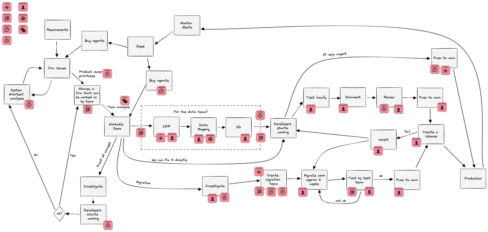
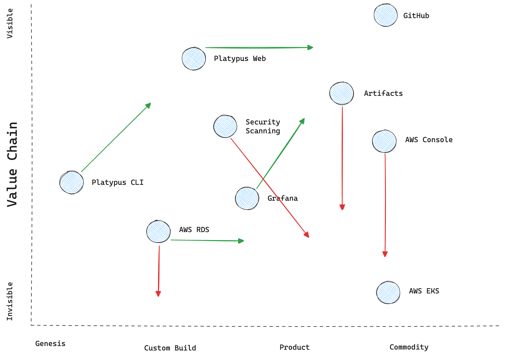

# Assess

The purpose of the assess phase is to go and interact with your users, learn their domain and understand their pains to prevent you building based on assumptions.

Assessing is a continuous process; it should capture the current state which will be continuously changing over time.

## Research Methods

The research methods recommended by XYZ are as follows:

1. Value Stream Mapping - *short description*
2. Wardley Mapping - *short description*
3. Gemba Walks - *short description*
4. Surveys - *short description*

You do not need to apply all the methods recommended. Choose what is best for you and you can add your own of course (these are just recommendations).

### Research Method: Value Stream Mapping

A Value Stream Map is a way to visualise the steps required to take an idea from conception to production.

### Research Method: Wardley Mapping

Visualise what tools / services you expose in your platform (y-axis) against their maturity (x-axis).

Easy to assess what interfaces a developer needs to interact with.

### Research Method: Gemba walks

Note: gemba walks in the remote age do not require you to meet in person, they can be done with screen sharing and the main goal is observing your users work.

### Research Method: Surveys

TODO

## Goal

What is the Definition of Done for the assess phase? Goal is to learn enough about your users to define or refine your [platform abstraction](./build.md).

## Notes

This framework does make recommendations for how often each research method should be conducted and does not imply that you need to perform all research methods during the same assessment period.
This for you to figure out what works best.

## Things to consider

- Do not expect everyone in your target audience to be a target user: it is better to make something great for a few people than build something general for everyone
