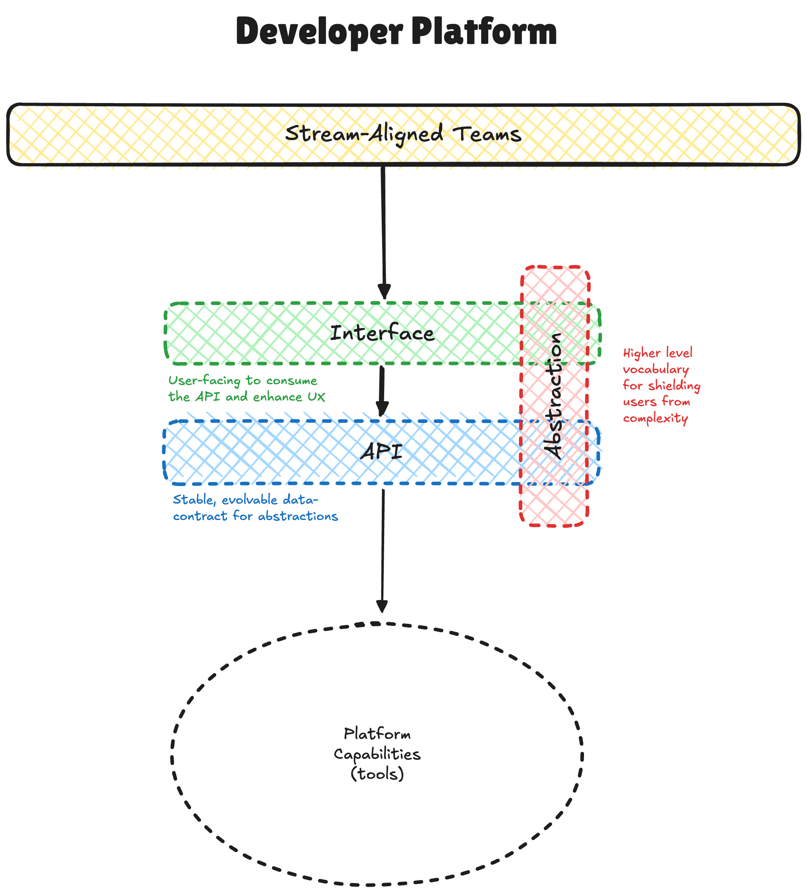

# Build

The build phase is about designing and implementing your platform.

The scope of this framework does not include the development process.
Though it does recommend following practices like building Minimum Viable Products (and Thinnest Viable Platforms), Continuous Delivery and Build-Measure-Learn.

## Platform Abstraction

The platform abstraction is a conceptual design layer.
It should document who your users are, the domain they work in and how they will interact with your platform.
This can be defined using user personas, domain models and user stories.

Feel free to choose whatever design techniques/methods/tools you use, as long as you document your users, their domain and how they will interact with that domain through your platform, that should cover the essentials.

> [!TIP]
> Reviewing the platform abstraction iteratively with your users is a great idea. It can help identify very early on if you have understood their domain and if they understand your abstraction.
💡

## Platform API

The platform API is the implementation of the platform abstraction.
It could be an HTTP-based API, a command-line tool or anything else that you implement and own.

The goals of the platform abstraction are to:

1. Decouple the platform from the underlying tools/services (i.e. capabilities)
2. Provide a stable data contract that enables backwards compatibility and evolution

## Platform Interface

The bit your sprinkle on top of the API that users interact with…

Do your users prefer YAML in a Git repository, a simple web-based form, or a CLI tool?
