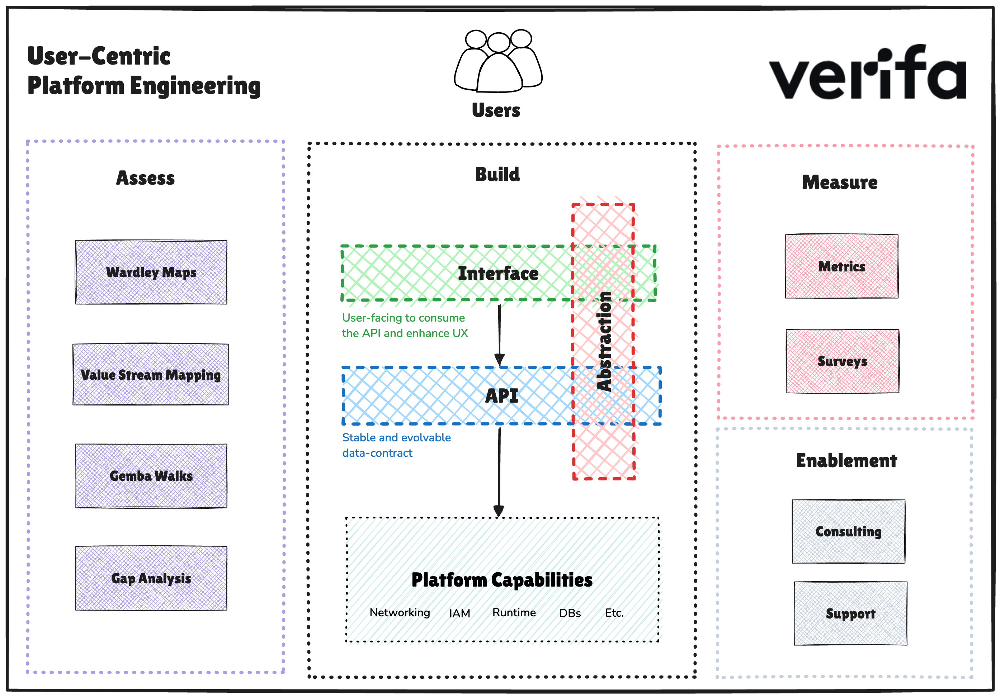

# XYZ Framework: User-Centric Platform Engineering

## Introduction

XYZ is a framework to help platform teams build user-centric internal platforms to streamline the value creation process for internal users (i.e. stream-aligned teams in Team Topologies). It is not a holistic framework which includes everything you need for building an internal platform. The purpose of XYZ is to help you focus on your users, rather than on the engineering of a platform.

> [!NOTE]  
> This is a work in progress and "XYZ" is a placeholder name until we come up with something good - suggestions welcome!

The core of the framework is about splitting the platform architecture into three layers: abstraction, API and interface. By starting with the abstraction, the platform team is required to design the platform from their users’ perspective and domain.

The framework is meant to be used iteratively and the phases are:

- [Assess](assess.md)
- [Build](build.md)
- [Measure](measure.md)
- [Enable](enable.md)

## Who it is for

Platform Teams or DevOps Teams. This framework works very well if you already have an existing platform or a collection of tools/services that you support.

This is like a concept: it could apply to any internal team offering a platform or product to its users.

## Why user centric platforms?

The framework helps you build user centric platforms. User centric platforms have these benefits:

### Business benefits

- Streamline the value creation process for users (e.g. accelerate software delivery).
- Autonomy and self-service for users.
- Decouple users from underlying capabilities: today it is AWS ECS, tomorrow it could be Kubernetes.
- Simple for users, but not necessarily simple to build: “simplicity is the art of hiding complexity” (Rob Pike)
- Scale: by modelling your data you will have a structure and process that scales, unlike letting your users create their own setups in the various tools you use.

### Platform team benefits

- Don’t build based on assumptions. Build based on user research.
- Scalability: shift from supporting users with everyday tasks to supporting a platform that enables its users with everyday tasks. A platform team that spends its time hand-holding and manually doing work for its users will not be sustainable and certainly not scale. It is a bottleneck for the business and ultimately, a bottleneck for your value creation.

## What you will get

If you follow this framework you will be more connected with your users and think in their domain, not the platform team's domain.
This is important because the platform team's domain is the kind of complexity you want to shield the user from, and allow them to work in their domain or one that they can easily understand.

By using methods in the [assess](./assess.md) phase you will be forced to meet your (potential) users, understand the domain that they work in, their pains and their needs.
This research will allow you to start defining a platform abstraction that is user-centric and is refined as you iteratively build your platform.

## What is not included

The scope of this framework is purposefully limited to try and do one thing well: to put your user at the centre of your platform design and development.

Anything related to development process, cloud architecture, contracts (such as SLAs), programming languages, and so on are not within scope.

## Rationale

The notion of building your “Platform as a Product” is well-known within the Platform Engineering space.
However, there are no guides or frameworks (that we know of) to help you with practical steps to achieve this.
While there is more to treating your platform as a product than is defined in this framework, our hope is that by following this framework you will be better connected with your users and build something that actually benefits them.

In our experience platform teams focus too much on the technical implementation of a platform and not enough on solving problems for its users.
The goal of this framework is to provide practical guidance for placing users at the centre of the platform.

## Project status

This framework is a work in progress.
However, don't let that deter you because we (at Verifa) have already found value in using it to guide teams.

## Contributing

Please use discussions for discussions, issues for issues and PRs for making changes.

## FAQ

See the [FAQ](faq.md) page.

## Sitemap

[Assess](assess.md)

[Build](build.md)

[Measure](measure.md)

[Enablement](enable.md)

[Frequently Asked Questions](faq.md)

[Resources](resources.md)
